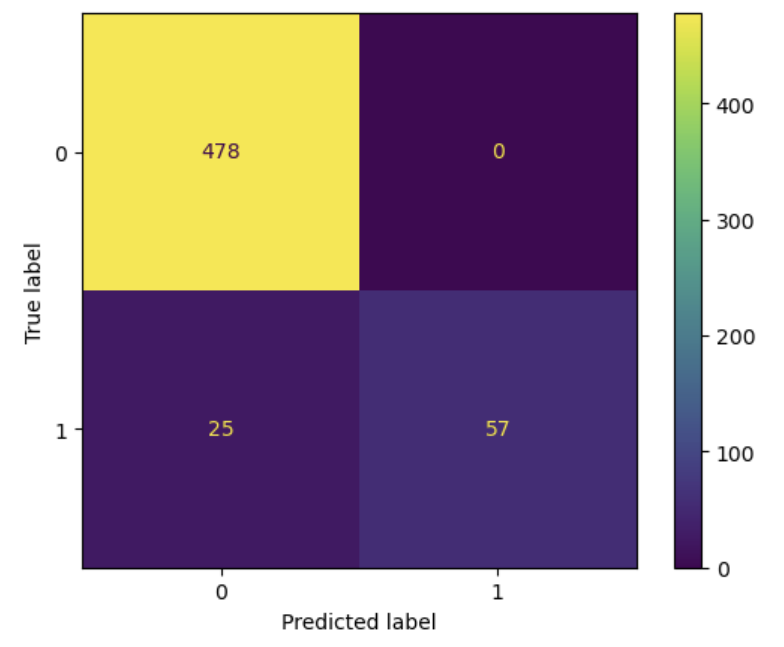
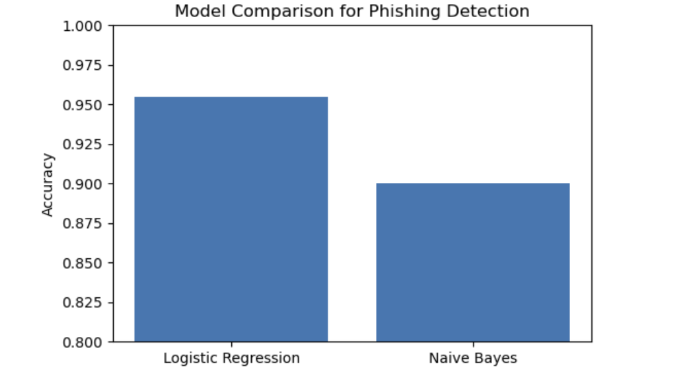
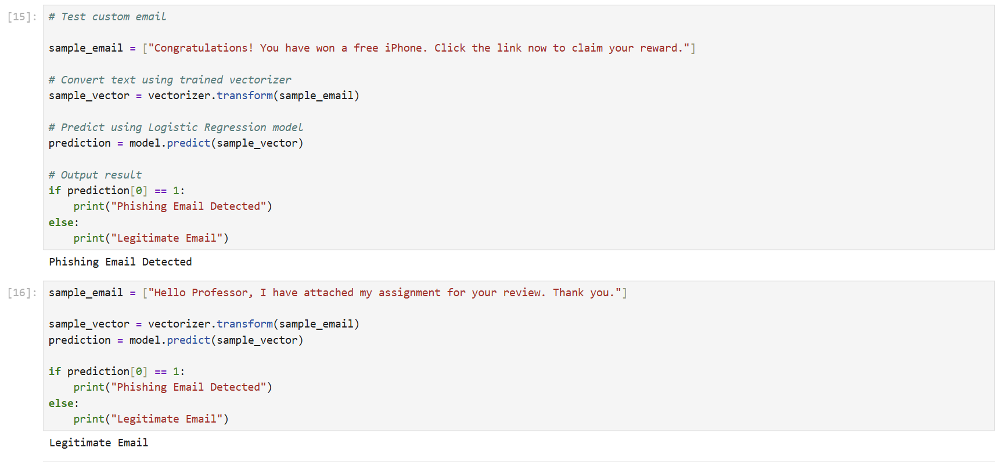

# Phishing Email Detection using NLP

## Overview
This project focuses on detecting phishing emails using Natural Language Processing (NLP) and Machine Learning techniques. The system analyzes email content and classifies emails as either legitimate or phishing.

The project uses TF-IDF vectorization and machine learning models such as Logistic Regression and Naive Bayes for email classification.

---

## Technologies Used

- Python
- Pandas
- NumPy
- Scikit-learn
- Matplotlib
- NLP (Natural Language Processing)
- TF-IDF Vectorization

---

## Dataset Information

The dataset contains email subjects and bodies labeled as:

- 0 → Legitimate Email
- 1 → Phishing Email

Dataset preprocessing steps included:
- Removing missing values
- Combining subject and body text
- Text cleaning and feature extraction

---

## Machine Learning Workflow

1. Load dataset
2. Clean missing values
3. Combine subject and email body
4. Convert text into numerical vectors using TF-IDF
5. Split data into training and testing sets
6. Train Logistic Regression model
7. Train Naive Bayes model
8. Evaluate models using accuracy and classification reports
9. Predict phishing emails from custom user input

---

## Model Performance

### Logistic Regression Results

- Accuracy: 95.5%
- Strong phishing detection capability
- High precision and recall performance

### Naive Bayes Results

- Accuracy: 90%
- Faster but lower phishing recall compared to Logistic Regression

---

## Sample Prediction

### Input Email
Congratulations! You have won a free iPhone. Click the link below to claim your reward.

### Prediction
Phishing Email Detected

---

## Visualizations

The project includes:
- Confusion Matrix
- Model Accuracy Comparison Graph
- Classification Reports

---

## Future Improvements

- Deep Learning integration
- BERT Transformer models
- Real-time phishing detection API
- Flask web deployment
- Explainable AI visualization

---

## Research Areas

- Artificial Intelligence
- Cybersecurity
- Natural Language Processing
- Machine Learning
- Email Threat Detection

---
---

## Project Visualizations

### Confusion Matrix

### Accuracy Comparison

### Prediction Demo

## Author

Srinivas Thota
